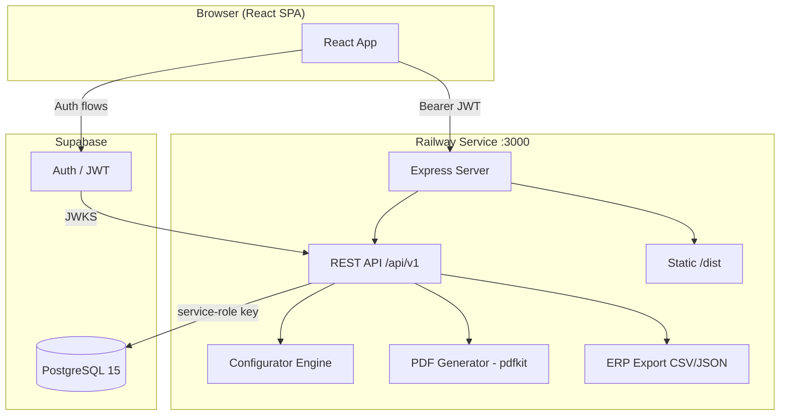

# AutoBuilder — Architecture

## Stack

| Layer | Technology | Rationale |
|---|---|---|
| Backend | Node.js 20, Express 5 | Single-service Railway deployment; Supabase JS SDK first-class |
| Frontend | React 18, Vite, Tailwind CSS | Compiled static assets served from same Express process |
| Database | Supabase PostgreSQL 15 | Free tier, connection pooling built-in |
| Auth | Supabase Auth (JWT) | SSO-ready, standard JWT, zero custom auth code |
| PDF | pdfkit (in-process) | Streamed, no infra overhead |
| Deploy | Railway (single service) | No Vercel—one service, one deploy |

## System Diagram



## Data Model

### Core Tables

**`profiles`** (extends Supabase `auth.users`)
- `id` uuid PK → auth.users.id
- `role` enum: sales_rep | assembly_author | ops_manager | it_admin
- `full_name` text

**`assembly_families`** (5 fixed families, seeded)
- `id` uuid PK
- `slug` text UNIQUE (e.g. `sf4500_standard`)
- `name` text
- `has_insulation` bool
- `has_armor` bool

**`components`** (the parts catalog)
- `id` uuid PK
- `family_id` uuid → assembly_families
- `component_type` text: fitting | hose | insulation | armor
- `name` text, `part_number` text, `unit_price` numeric, `uom` text
- `erp_code` text (P21 export)
- `metadata` jsonb (size, pressure ratings, compatible hose IDs)

**`recipes`** (assembly templates — authors manage these)
- `id` uuid PK
- `family_id` uuid, `version` int, `status` enum(draft|published|archived)
- `name` text, `authored_by` uuid, `published_at` timestamptz

**`recipe_steps`** (ordered slots per recipe)
- `id` uuid PK, `recipe_id` uuid, `step_order` int
- `slot_name` text, `component_type` text, `required` bool

**`recipe_rules`** (validation constraints, stored as JSONB DSL)
- `id` uuid PK, `recipe_id` uuid
- `rule_type` text: requires | excludes | range | conditional
- `condition` jsonb, `message` text

**`configurator_sessions`** (in-progress configurations)
- `id` uuid PK, `recipe_id` uuid, `created_by` uuid
- `family_id` uuid, `details` jsonb, `components` jsonb
- `validation` jsonb, `status` enum(active|quoted)

**`quotes`**
- `id` uuid PK, `quote_number` text UNIQUE
- `created_by` uuid, `customer_name` text
- `total_price` numeric, `status` enum(draft|sent|accepted|expired)

**`quote_line_items`**
- `id` uuid PK, `quote_id` uuid, `session_id` uuid
- `quantity` int, `unit_price` numeric, `line_total` numeric
- `bom_snapshot` jsonb (immutable BOM at time of quoting)

**`audit_log`** (append-only)
- `id` uuid PK, `actor_id` uuid, `action` text
- `entity_type` text, `entity_id` uuid, `payload` jsonb, `created_at` timestamptz

## Configurator Engine

Pure in-process module (`src/engine/configurator.js`). Takes a recipe + rules + user selections → returns validation result + computed price.

Rule DSL (stored in `recipe_rules.condition` jsonb):
- **`requires`**: if slot A = X, slot B must be filled
- **`excludes`**: components A and B are mutually incompatible
- **`range`**: numeric field must be within [min, max]
- **`conditional`**: given slot A = X, slot B must be one of [Y, Z]

Evaluation order:
1. Required slots filled check
2. Component type matches slot type
3. Rule evaluation (all rules in order)
4. Price computation (sum of selected component unit prices + per-foot multiplier if applicable)

Same logic ships to browser as ES module for live validation feedback; server is authoritative.

## API Endpoints

```
POST   /auth/session              exchange Supabase token → profile + role
GET    /auth/me

GET    /families                  list 5 assembly families
GET    /families/:id/components   parts catalog grouped by type

GET    /recipes                   list (filterable by family, status)
POST   /recipes                   create draft
GET    /recipes/:id               recipe + steps + rules
PUT    /recipes/:id               update draft
POST   /recipes/:id/publish       publish (immutable snapshot)

POST   /sessions                  create configurator session
GET    /sessions/:id              load session
PATCH  /sessions/:id              update selections (triggers validation)

GET    /quotes                    list (scoped by role)
POST   /quotes                    create quote from session
GET    /quotes/:id                quote detail
GET    /quotes/:id/pdf            stream PDF download
GET    /quotes/:id/export         ERP CSV download
PUT    /quotes/:id/submit         mark as sent

GET    /reports/parity            parity summary
GET    /admin/users               user list
PUT    /admin/users/:id/role      change role

GET    /healthz                   200 OK health check
```

## Frontend Routes

```
/                               Dashboard
/login                          SSO login
/configure                      Family Select (creates new session)
/configure/:sessionId/details   Hose specs + length
/configure/:sessionId/components End fittings, insulation, armor
/configure/:sessionId/review    Summary + validate
/configure/:sessionId/quote     Quote output + PDF download
/quotes                         Quote list
/quotes/:id                     Quote detail
/library                        Assembly library (published recipes)
/admin/recipes                  Recipe list [author]
/admin/recipes/:id              Recipe editor [author]
/admin/parity                   Parity report [ops]
/admin/users                    User management [it-admin]
```

## Environment Variables

### Railway service
```
NODE_ENV=production
PORT=3000
SUPABASE_URL=https://<project>.supabase.co
SUPABASE_SERVICE_ROLE_KEY=<service-role-key>
SUPABASE_JWT_SECRET=<jwt-secret>
VITE_SUPABASE_URL=https://<project>.supabase.co
VITE_SUPABASE_ANON_KEY=<anon-key>
```

## Implementation Waves (Dependency Order)

```
Wave 1 — Foundation
  - Supabase schema migration + seed (5 families, sample components)
  - Express skeleton: /healthz, static serving, JWT middleware
  - React shell: Vite config, auth context, role-gated routing
  ✓ Gate: Railway deploy succeeds, /healthz → 200

Wave 2 — Catalog + Recipes
  - Components CRUD API + admin UI
  - Recipe CRUD + step/rule editor
  ✓ Gate: author can create and publish a recipe

Wave 3 — Configurator (core value)
  - Configurator engine module (unit tested)
  - Sessions API (create, patch, validate)
  - 4-step configurator UI with live validation
  ✓ Gate: sales rep configures all 5 family types successfully

Wave 4 — Quoting
  - Quotes API (create, line items, submit)
  - Quote UI + PDF generation
  ✓ Gate: complete quote with PDF download

Wave 5 — Reports + Hardening
  - ERP CSV export + parity report endpoint
  - Error boundaries, loading states, seed demo data
  ✓ Gate: end-to-end happy flow passes Playwright test
```
